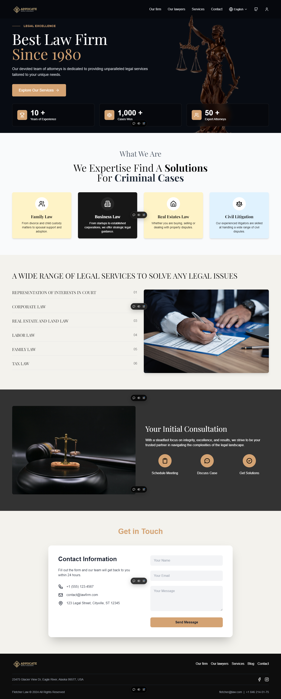

<div align="center">
  
# 🏛️ Law Firm App - React + Vite



Welcome to the **Law Firm App**, a modern web application designed to provide essential services for law firms. This project is built with **React** and powered by **Vite**, ensuring fast development cycles, a smooth user experience, and highly performant builds.

</div>

## 🔑 Key Features

- **Responsive Design**: A user-friendly, mobile-first interface that adapts beautifully across devices
- **Dynamic Content**: Easily navigate between different sections, including the firm's services, lawyer profiles, and contact information
- **Language Selector**: Support for multiple languages including English, French, and Arabic
- **Fast & Efficient**: Leveraging **Vite** for instant hot module replacement (HMR) and optimized builds
- **GitHub Integration**: Direct link to GitHub profile and easy navigation for code collaboration

## ⚙️ Tech Stack

This project utilizes modern technologies to ensure high performance and smooth user experiences:

- **React**: A powerful JavaScript library for building user interfaces
- **Vite**: Lightning-fast development environment with optimized builds
- **Lucide Icons**: Clean, customizable icons for navigation and actions
- **Tailwind CSS**: A utility-first CSS framework for rapid styling
- **React Router**: For smooth client-side routing and navigation

## 🚀 Quick Start

To get started with the project, follow these steps:

1. **Clone the repository**:

```bash
git clone https://github.com/Hamaarour/lawyer-app.git law-firm-app
cd law-firm-app
```

2. **Install dependencies**:

```bash
npm install
```

3. **Run the development server**:

```bash
npm run dev
```

4. **Build for production**:

```bash
npm run build
```

5. **Preview the production build**:

```bash
npm run preview
```

## 🌐 Language Support

The app provides a multilingual experience with support for:

- English (EN)
- French (FR)
- Arabic (AR)

Users can easily switch languages using the language selector integrated into the navigation bar.


## 📄 ESLint & Plugins

This template includes ESLint to enforce best practices and code consistency. It is configured with two official Vite plugins for React:

- `@vitejs/plugin-react`: Uses Babel for Fast Refresh
- `@vitejs/plugin-react-swc`: Uses SWC for Fast Refresh, offering a faster build

You can choose which one suits your needs by following the plugin documentation.

## 🛠️ Development Tools

The project uses the following developer tools to enhance productivity and maintain clean code:

- **Prettier**: Automatic code formatting
- **ESLint**: Linting for maintaining code quality
- **HMR (Hot Module Replacement)**: Instant updates during development without page reloads

## 👥 Contributors

We welcome contributions! Please fork the repository and submit pull requests for improvements, bug fixes, or new features.

## 📞 Contact

For any inquiries, feel free to reach out via our Contact Page or visit our official website.
